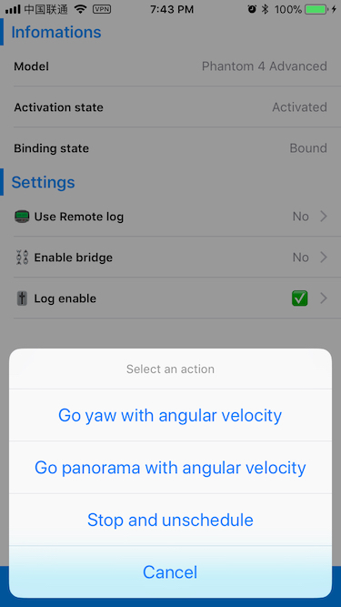

# TimelineOfAircraftYaw
This demo is created to describe an [issue](https://github.com/dji-sdk/Mobile-SDK-iOS/issues/184) of `DJITimelineMission`.

## Install
The demo relys on [DJIDemoKit](https://github.com/PandaraWen/DJIDemoKit), a handy framework to build DJI-device-releated demo. So you have to run `pod install` before build this demo project.

## Detail
### 0x01
Option **Go yaw with angular velocity** would let you specify an angular velocity, then schedules **8** `TimelineElement` of `DJIAircraftYawAction` with `relativeAngle` of **45** degrees, and `angularVelocity` of your specified angular velocity. Finally try start that timeline.

### 0x02
Option **Go panorama with angular velocity** would combine `DJIGimbalAttitudeAction`, `DJIAircraftYawAction`, `DJIShootPhotoAction` to take photos that can be used to generate panorama images.

### 0x03
Option **Stop and unschedule** would stop the current timeline and unschedule everything.

